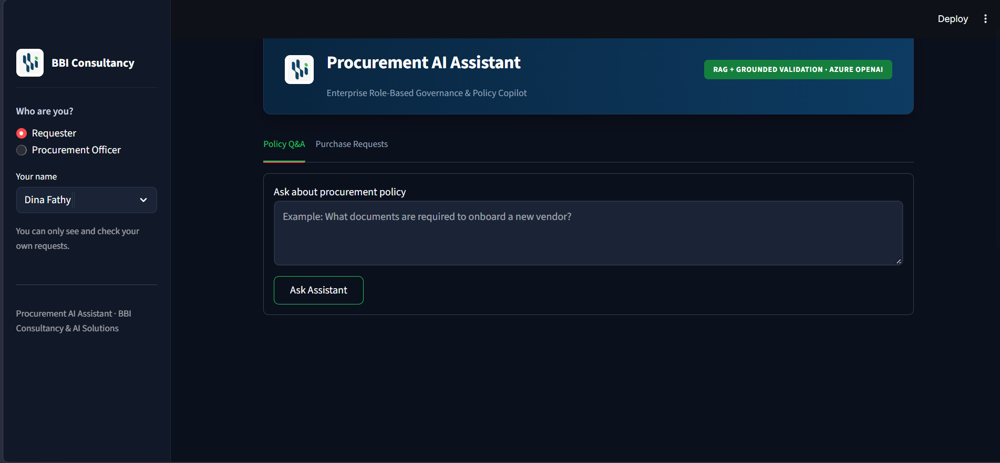

# Procurement AI Assistant

A role-based, retrieval-augmented AI assistant for procurement operations, built on Azure AI
Search and Azure OpenAI. The assistant answers policy questions, validates purchase requests,
and generates portfolio-level summaries — with every answer grounded in the organization's
actual documents and data, and access scoped by role.

---

## The Data

The project works with two distinct data sources, deliberately handled in two different ways:

| Type | Source | How it's used |
|---|---|---|
| **Unstructured** | Vendor documents (trade license, tax certificate, bank letter, registration form, company profile) + policy documents (Procurement Policy, Purchase Request Guidelines, Vendor Onboarding Guide, Supplier Code of Conduct) | Indexed in Azure AI Search (hybrid vector + keyword search), retrieved as grounding context for the language model |
| **Structured** | `data/Sample_Purchase_Requests.csv` — 80 purchase request records | Queried directly with pandas (exact-match lookups and aggregates), never through semantic search |

---

## Why Role-Based: What the Data Showed

Before designing the system, the purchase request dataset was analyzed to understand where the
real bottleneck in the procurement process actually is.

**Headline findings:**
- **63%** of purchase requests are flagged with missing information.
- **73%** of requests are stuck in a pending state (Draft / Submitted / In Review) — neither
  approved nor returned.
- Only **14%** of requests reach final approval.

**Breaking down the flagged issues (`Notes` on incomplete requests):**
- **50%** — insufficient quotations (fewer than the policy-required number for the amount).
- **26%** — missing business justification.

This points to a clear root cause: a large share of requests stall simply because requesters
submit them without fully knowing the procurement policy's requirements (quotation thresholds,
mandatory fields, etc.) — not because of any issue on the approval side.

**Why this backlog matters — business justification analysis:**

To understand the real cost of this bottleneck, business justifications across all requests
were categorized:

| Justification Category | Share |
|---|---|
| Replacement of outdated equipment | 31% |
| Compliance / service continuity | 27.9% |
| Approved project delivery | 24% |
| Operational efficiency | 16% |

**52%** of all requests exist to support an active service or project (compliance/continuity +
project delivery combined). In other words, when a request stalls in the pipeline, it isn't an
abstract paperwork delay — it's a real risk of a service or project being disrupted. Requesters
are not submitting requests casually; the justification data shows they generally have a
legitimate, well-grounded business need. The bottleneck is procedural, not a lack of genuine need.

**This is the problem the system is built to solve** — not generically, but at its actual
source: the moment a request is first submitted.

---

## How the Architecture Responds to This

The system is split by role so that each type of user is only given what they need to fix the
part of the problem that belongs to them:

- **Requester** — gets a focused assistant, grounded only in the Purchase Request Guidelines and
  Procurement Policy, whose entire purpose is to help a request be submitted *complete* the
  first time: correct mandatory fields, correct number of quotations for the amount, no missing
  business justification. This directly targets the 63%/50%/26% findings above, at the point
  where they originate.
- **Procurement Officer** — gets the full operational toolkit: vendor eligibility checks,
  document verification across all vendor records, policy Q&A across the complete document set,
  and a portfolio-wide summary (status breakdown, flagged issues, department-level volume) built
  from precomputed statistics over the full dataset.

Access is enforced on three independent layers — which documents can be retrieved, which
purchase request rows can be viewed, and how each role's assistant is instructed to reason —
rather than relying on the interface alone to hide what a role shouldn't see.

---

## Project Structure

```
procurement-ai-assistant/
├── data/
│   └── Sample_Purchase_Requests.csv       # structured purchase request dataset
├── EDA/
│   └── EXP.ipynb                           # exploratory analysis behind the findings above
├── deployment/
│   ├── app.py                              # Streamlit UI (role-aware)
│   └── bbi_logo.png
├── src/
│   ├── all_schemas.py                      # JSON schemas enforced on every LLM response
│   ├── system_prmpts.py                    # role-specific system prompts
│   ├── llm_ulits.py                        # Azure OpenAI call wrapper (schema-constrained)
│   ├── ploicy_role.py                      # Azure AI Search retrieval + role-based filtering
│   ├── csv_response.py                     # structured lookups over the purchase request data
│   ├── Office_QA_rag.py                    # Officer-facing: policy Q&A + portfolio summary
│   └── Req_QA_rag.py                       # Requester-facing: policy Q&A + request validation
└── demo.txt
```

---

## Setup

1. **Install dependencies**
   ```bash
   pip install streamlit pandas openai azure-search-documents python-dotenv
   ```

2. **Environment variables** — create a `.env` file in the project root with:
   ```
   AZURE_SEARCH_ENDPOINT=...
   AZURE_SEARCH_API_KEY=...
   AZURE_SEARCH_INDEX_NAME=...
   AZURE_OPENAI_ENDPOINT=...
   AZURE_OPENAI_API_KEY=...
   AZURE_OPENAI_CHAT_DEPLOYMENT=gpt-5-mini
   AZURE_OPENAI_EMBEDDING_DEPLOYMENT=text-embedding-3-small
   ```

3. **Run the app**
   ```bash
   cd deployment
   streamlit run app.py
   ```

---

